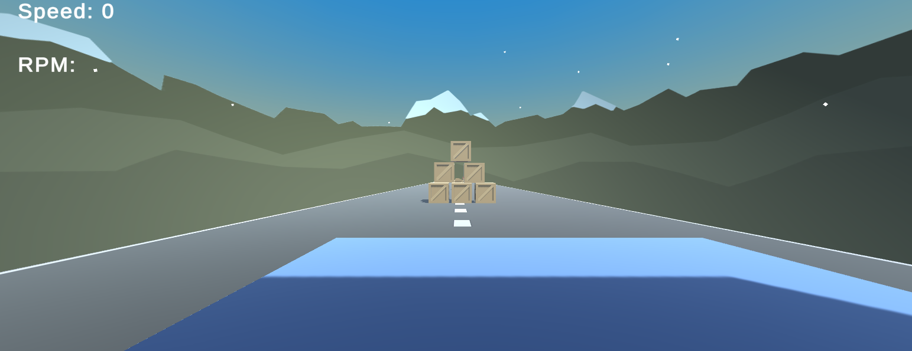
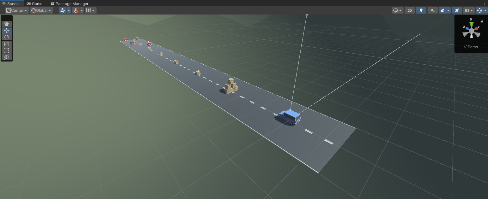

# 🚗 Unity Beginner Prototype – Vehicle Movement Project

This Unity project is a simple yet educational prototype designed for beginners who want to learn the basics of 3D scene setup, user input, physics systems, and camera following. The vehicle moves forward at a constant speed, launches obstacles into the air upon collision, and is followed by a camera from a fixed distance.

---

## 📸 Screenshots

### 🎮 Game View:

### 🛠️ Scene View:

---

## 📚 Project Summary

### 🔧 Scene Setup

- A new Unity project was created.
- Necessary assets (vehicle, road, boxes) were imported into the scene.
- The vehicle was positioned at the start of the road, and the boxes were placed along the path.
- The camera was placed behind the vehicle.
- UI elements display speed and RPM on screen using TextMeshPro.

---

## 🚙 Vehicle Behavior

- The vehicle moves forward at a constant speed (`Time.deltaTime` ensures frame rate independence).
- C# scripts utilize `Start()` and `Update()` methods for continuous movement.
- When the vehicle collides with boxes, the boxes are launched into the air using physics (`Collider` + `Rigidbody`).
- The player can control the vehicle with arrow keys:
  - ↑ / ↓ → move forward / backward  
  - ← / → → turn left / right  

---

## 🧠 Key Concepts Learned

- Movement with `Transform.Translate()` and `Transform.Rotate()`
- Using `Rigidbody` for physics-based interactions
- Capturing input using `Input.GetAxis()`
- Placing `GameObjects` and organizing the scene with `Empty Objects`
- Core C# programming concepts: `Variables`, `Methods`, `Access Modifiers`
- Implementing a camera follow script with fixed offset logic

---

## 🛠️ Tools & Components Used

- Unity 3D
- C#
- Rigidbody, Collider components
- UI (TextMeshPro)
- Custom Camera Follow Script
- Unity Physics System

---

## 🗂️ Project Structure
